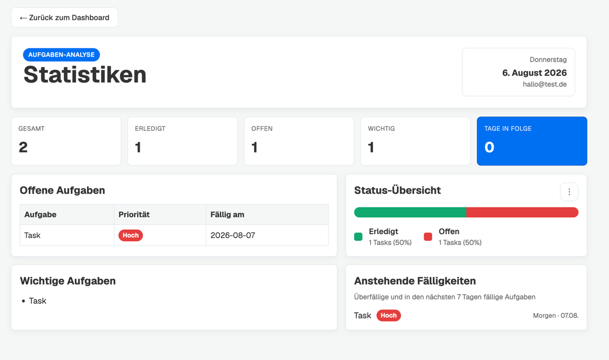

# 5. Webdesign

Die folgenden Prinzipien stammen aus der Vorlesung „Webengineering 1_2“ (Lukas Panni).

## Design-Idee & Ziele

TypeShit ist ein reines Werkzeug, kein Marketing-Produkt – das Design verfolgt nur funktionale statt
dekorative Ziele. Passend zu den in der Vorlesung genannten „wichtigen Aspekten im Webdesign“
(benutzerzentrierte Entwicklung, Barrierefreiheit, Wirtschaftlichkeit) haben wir bewusst Kompromisse
getroffen statt jedes Detail auszureizen:

- **Klarheit statt Dekoration:** neutrale Flächenfarben, ein einziger Akzentton (`--primary-color: #0070f3`)
  für alle interaktiven Elemente, damit Nutzer sofort erkennen, wo sie interagieren können (Affordance).
- **Statusfarben mit Bedeutung:** Grün (`#10a86f`) = erledigt/positiv, Rot (`--danger-color: #e53e3e`) =
  überfällig/kritisch, Gelb/Orange = mittlere Priorität – analog zur Ampel-Metapher aus der Vorlesung
  („Farben können Informationen vermitteln“).
- **Wenige Farben und Schriftarten:** durchgängig eine Schriftfamilie (Geist Sans) und ein zentral in
  [`globals.css`](../frontend/src/app/globals.css) definiertes, kleines Farb-Set statt Seiten-für-Seite
  neuer Werte – Konsistenz statt Abwechslung.
- **Datendichte nur wo nötig:** Formulare (Login, Aufgabe anlegen) sind bewusst reduziert und einspaltig,
  mit viel Weißraum; die Statistik-Seite darf dichter sein, da sie zum Auswerten statt zum schnellen
  Erfassen dient.

## Analyse Beispielseite 1: Login (`frontend/src/app/login/`)

| Prinzip (aus der Vorlesung) | Anwendung auf dieser Seite                                                                                                                                                                                                                                                                 |
|----------------------------|--------------------------------------------------------------------------------------------------------------------------------------------------------------------------------------------------------------------------------------------------------------------------------------------|
| **Weißraum**               | Das Formular ist auf `max-width: 400px` begrenzt und vertikal zentriert (`margin: 4rem auto`) – bewusst viel „leerer“ Bereich drumherum statt die Seite vollzupacken. Nur zwei Eingabefelder und ein Button sind sichtbar; kein „verschwendeter Platz“, sondern erhöht Lesbarkeit und Fokus. |
| **Affordance**             | Der Login-Button ist deutlich als Button erkennbar (gefüllte Fläche, `border-radius`, `cursor: pointer`, Hover-Farbwechsel) – dadurch wird die Usability intuitiv.                                                                                                                         |
| **Constraint**             | Der Button ist so lange `disabled`, bis E-Mail und Passwort ausgefüllt sind                                                                                                                                                                                                                || !password || isLoading}`) – eine falsche Bedienung (Absenden mit leeren Feldern) wird durch das UI selbst unterbunden statt erst per Fehlermeldung abgefangen. |
| **Feedback**               | Während des Requests wechselt der Button-Text zu „Logge ein…“ und wird deaktiviert; Fehler erscheinen unmittelbar unter dem Formular in Rot. Rückmeldung erfolgt also schnell und klar wahrnehmbar.                                                                                        |
| **Konsistenz**             | Nutzt dieselben Design-Tokens (`--primary-color`, `--border-color`, `--border-radius`) wie der Rest der App – die Registrierungs- und „Passwort vergessen“-Seiten teilen sich CSS-Datei (`login.module.css`), statt eigene Stile zu haben.                                    |
| **Barrierefreiheit**       | Jedes Eingabefeld hat ein zugeordnetes `<label htmlFor>`|

## Analyse Beispielseite 2: Statistik-Seite (`frontend/src/app/statistics/`)

| Prinzip (aus der Vorlesung) | Anwendung auf dieser Seite                                                                                                                                                                                                         |
|---|------------------------------------------------------------------------------------------------------------------------------------------------------------------------------------------------------------------------------------|
| **Gesetz der Nähe** | Zusammengehörige Informationen sind gruppiert und durch Rahmen von anderen Gruppen abgegrenzt – „Offene Aufgaben“, „Status-Übersicht“, „Wichtige Aufgaben“ und „Anstehende Fälligkeiten“ sind klar getrennte Blöcke in einem Grid. |
| **Strukturierung der Benutzerschnittstelle** | Die Seite ist klar in Kopfbereich (Titel + Datum), Kennzahlen-Zeile und eine Übersicht mit den Auswertungen unterteilt – jeder Bereich hat eine eindeutige Funktion, keine Vermischung von Übersicht und Detail.                   |
| **Kombination visueller und textueller Elemente** | Prioritäten/Status werden nicht nur über Farbe, sondern zusätzlich über Text kommuniziert (Badge-Label „Hoch“/„Erledigt“ etc.) – hilfreich zum Verständin (z.B. bei Farbsehschwäche).                                              |
| **Farbgestaltung** | Wenige, konsistent bedeutungstragende Farben: Grün = erledigt, Rot = offen/überfällig, Gelb/Orange = mittlere Priorität – sowohl im Balken- als auch im Kreis-Diagramm                                                             |
| **Feedback / Sichtbarkeit möglicher Aktionen** | Beim Umschalten zwischen Balken- und Kreis-Ansicht markiert ein Häkchen (`✓`) im Dropdown die aktuell aktive Option – der Zustand ist jederzeit klar erkennbar.                                                                    |
| **Responsive Design (Mobile First-Anpassung)** | Media Queries bei `980px` und `700px` reduzieren die Spaltenzahl des Gridsund stapeln den Header vertikal, statt Inhalte nur zu verkleinern.                                                                                       |
| **Konsistenz mit dem restlichen Design** | Gleiche Radien, Rahmenfarben und Schriftskala wie auf Login/Dashboard; einzig die zusätzlichen Statusfarben (Grün/Gelb/Rot) kommen als bedeutungstragende Erweiterung hinzu.                                                       |
