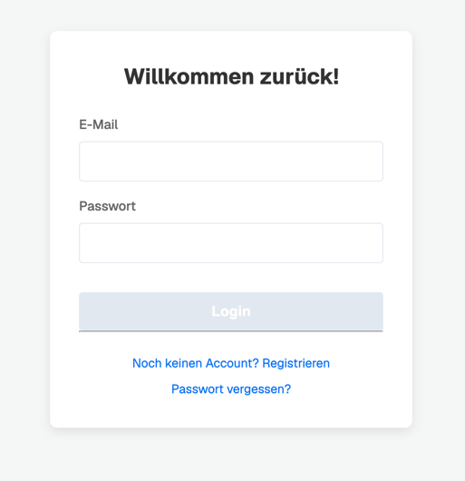
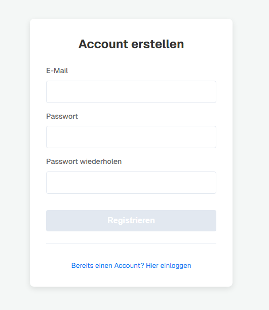
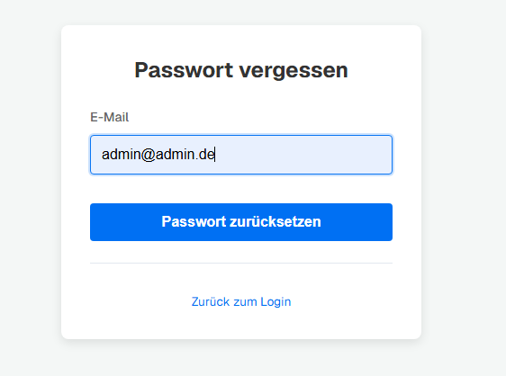
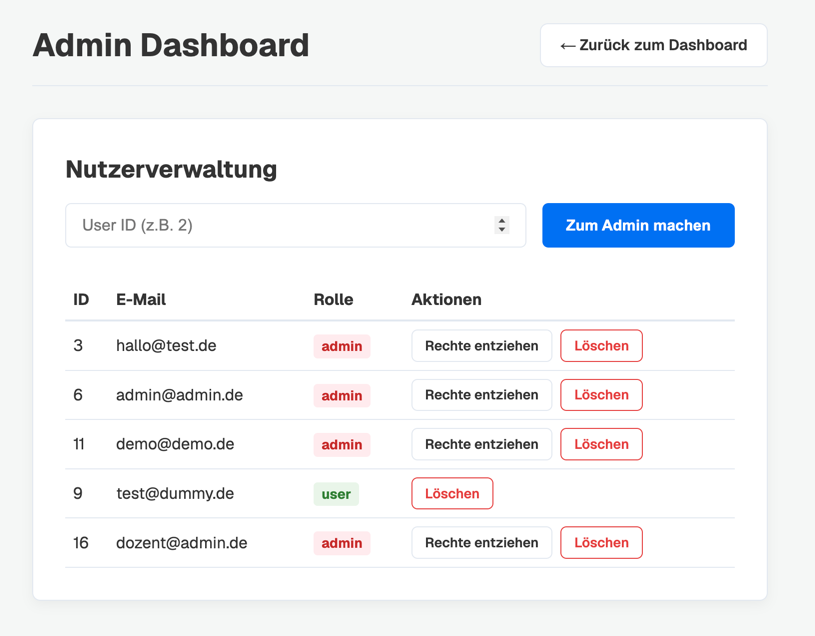

# Eigenleistung – Matrikelnummer: 6158233

## Funktion: Authentifizierung & Rollen (Login/Logout/Register/Forgot-Password, Rollenmodell, Admin-Dashboard)

## 1. Beschreibung der Funktion
Diese Funktion umfasst den vollständigen Authentifizierungs-Lebenszyklus sowie die Rechteverwaltung der Applikation. Aus Nutzersicht können sich neue Anwender registrieren, bestehende Nutzer sicher einloggen und ihre Sitzung über einen sauberen Logout beenden. Falls ein Passwort vergessen wurde, steht ein kryptografisch abgesicherter Wiederherstellungsprozess per generiertem E-Mail-Token zur Verfügung.
Darüber hinaus beinhaltet die Funktion ein dediziertes Admin-Dashboard. Hierüber können privilegierte Nutzer (Admins) andere Konten systemweit verwalten, ihnen Admin-Rechte zuweisen, diese wieder entziehen oder Benutzerkonten vollständig löschen.

## 2. Einbindung in das Gesamtprojekt
- **Frontend:** Implementierung des globalen Authentifizierungs-Status und des clientseitigen Routings über `frontend/src/contexts/AuthContext.tsx`.<br>
Darstellung der UI-Ansichten in `frontend/src/app/login/page.tsx`, `frontend/src/app/register/page.tsx`, `frontend/src/app/forgot-password/page.tsx` und `frontend/src/app/reset-password/page.tsx`.<br>
Das Dashboard zur Rechteverwaltung befindet sich in `frontend/src/app/admin/page.tsx` mit zugehörigen asynchronen API-Aufrufen in `frontend/src/app/services/userService.ts`.
- **Backend:** Entwicklung der entsprechenden API-Endpunkte in `backend/src/index.ts` (`POST /api/auth/register`, `POST /api/auth/login`, `POST /api/auth/logout`, `POST /api/auth/request-reset`, `POST /api/auth/reset-password`, `GET /api/users`, `PATCH /api/users/:id/promote`, `PATCH /api/users/:id/demote`, `DELETE /api/users/:id`).<br> 
Die Absicherung der geschützten Routen im Backend erfolgt zentral über die Middleware-Funktion `authenticateToken` in der `backend/src/index.ts`.

## 3. Entwickelter Code (Dateien, Auszüge)

### `frontend/src/contexts/AuthContext.tsx` – Clientseitiges Routing & Storage
```tsx
  useEffect(() => {
    const token = sessionStorage.getItem('auth_token');
    const storedEmail = sessionStorage.getItem('user_email');
    const storedRole = sessionStorage.getItem('user_role') as 'user' | 'admin' | null;

    if (token) {
      setIsAuthenticated(true);
      setEmail(storedEmail);
      setRole(storedRole);
    } else {
      const publicRoutes = ['/login', '/register', '/forgot-password', '/reset-password'];
      if (!publicRoutes.includes(pathname)) {
        router.push('/login');
      }
    }
  }, [pathname, router]);
```

### `backend/src/index.ts` – Rechteverwaltung (Admin-Routen)
```ts
app.patch('/api/users/:id/promote', authenticateToken, async (req: AuthRequest, res: express.Response) => {
  try {
    if (req.user!.role !== 'admin') {
      return res.status(403).json({ error: 'Zugriff verweigert' });
    }
    const id = Number(req.params.id);
    await db.update(users).set({ role: 'admin' }).where(eq(users.id, id));
    res.json({ message: `User mit ID ${id} wurde zum Admin befördert.` });
  } catch (error) {
    res.status(500).json({ error: 'Beförderung fehlgeschlagen' });
  }
});

app.delete('/api/users/:id', authenticateToken, async (req: AuthRequest, res: express.Response) => {
  try {
    if (req.user!.role !== 'admin') {
      return res.status(403).json({ error: 'Zugriff verweigert' });
    }
    const id = Number(req.params.id);
    await db.delete(users).where(eq(users.id, id));
    res.json({ message: `User mit ID ${id} wurde gelöscht.` });
  } catch (error) {
    res.status(500).json({ error: 'Löschen fehlgeschlagen' });
  }
});
```

- Commits:
  - `Login/Logout Funktion und Css-Vereinheitlichung`
  - `Temporäre Loginfunktion und QoL Fixes für bestehende Dateien`
  - `added forgot-password and register page`
  - `Integretation of roles and start for backend/login`
  - `login & register now connected with db`
  - `Impl: admin dashboard and functions`
  - `fix: admin role misplacement`

## 4. Zugrundeliegende Ideen & Funktionsweise
- **Kryptografie & Sicherheit:** Passwörter werden niemals im Klartext gespeichert, sondern über die Bibliothek `bcrypt` mit einem Salted-Hash-Verfahren in der PostgreSQL-Datenbank hinterlegt. Für den Passwort-Reset wird über das Modul `crypto` ein kryptografisch sicherer, hexadezimaler Token generiert, der mit einer strengen Ablaufzeit von einer Stunde in der Datenbank persistiert wird.
- **Stateless Sessions (JWT):** Die Autorisierung zwischen Frontend und Backend erfolgt komplett zustandslos über JSON Web Tokens (JWT). Nach erfolgreichem Login generiert das Backend einen Token, der eine kryptografische Signatur sowie die `userId`, die E-Mail und die spezifische `role` des Nutzers als Payload enthält. Dieser Token wird im React-Frontend im `sessionStorage` vorgehalten und bei jedem geschützten API-Call im `Authorization`-Header als Bearer-Token an das Backend übergeben.
- **Rollengesteuerte Autorisierung:** Die serverseitige Middleware `authenticateToken` verifiziert bei geschützten Routen zunächst die Integrität und Gültigkeit des JWTs. Spezifische Endpunkte für das Management (wie das Löschen von Nutzern) greifen anschließend auf den verifizierten Payload zurück und prüfen explizit, ob `req.user!.role === 'admin'` zutrifft, um unberechtigte Privilege Escalation technisch auszuschließen.

## 5. Getroffene Entscheidungen

### Wechsel von `localStorage` zu `sessionStorage` für das JWT-Management
Ursprünglich wurde der JSON Web Token (JWT) nach erfolgreichem Login im `localStorage` des Browsers abgelegt. Dies führte jedoch zu unerwünschtem Verhalten beim Neustart der Applikation, da dieser Speicher browserübergreifend persistent ist. Ein Token überlebte somit das vollständige Schließen des Browsers, was aus Sicherheitsperspektive für ein Administrations-Dashboard problematisch ist und einen sauberen Login-Flow behinderte.
**Entscheidung:** Das Speicherkonzept wurde konsequent auf den flüchtigen `sessionStorage` umgestellt. Dadurch wird technisch garantiert, dass die Sitzung unwiderruflich erlischt, sobald der Benutzer den aktuellen Browser-Tab oder das Fenster schließt. Dies entspricht den Security Best Practices und erzwingt einen authentischen Login-Flow bei jedem Neustart.

### Ablösung der serverseitigen Next.js-Middleware durch clientseitiges Routing
In einer früheren Programmversion wurde versucht, unautorisierte Zugriffe über die serverseitige Next.js-Middleware (`middleware.tsx`) abzufangen. Da der Authentifizierungs-Token jedoch aus Architekturgründen im clientseitigen `sessionStorage` abgelegt wurde, kam es zu einem technischen Konflikt: Der Server (Middleware) hatte keinen Zugriff auf den Browser-Speicher und blockierte fälschlicherweise legitime Aufrufe, was zu fehlerhaften Redirect-Schleifen führte.
**Entscheidung:** Die serverseitige Middleware wurde architektonisch verworfen. Stattdessen wurde die Routing-Kontrolle vollständig in den React-Client verlagert. Der `AuthContext.tsx` fungiert nun als dynamischer, clientseitiger "Türsteher". Durch die Kombination der Hooks `usePathname` und `useEffect` prüft das Frontend bei jedem Komponenten-Mount aktiv den Zustand des `sessionStorage` und leitet unautorisierte Nutzer kompromisslos auf freigegebene Routen (z. B. `/login` oder `/register`) um.

## 6. Screenshots
Die folgende Sektion dokumentiert die visuellen Schnittstellen der Authentifizierungs- und Rechteverwaltung, inklusive einer kurzen Erläuterung der Funktionalität und Bedienung für den Endnutzer.

### Login
<br>
**Bedienung & Funktion:** Die primäre Eingabemaske für bestehende Nutzer. Nach Eingabe von E-Mail und Passwort erfolgt die Validierung gegen die Datenbank. Bei erfolgreicher Authentifizierung wird der JWT im Session-Storage abgelegt und der Nutzer erhält Zugriff auf seine geschützten Aufgaben- und Dashboard-Ansichten.

### Registrierung
<br>
**Bedienung & Funktion:** Die Schnittstelle zur Anlage neuer Konten. Nutzer geben ihre gewünschte E-Mail-Adresse und ein mindestens sechstelliges Passwort ein. Das System hasht das Passwort serverseitig via `bcrypt`, bevor es dauerhaft in der Datenbank persistiert wird. Anschließend erfolgt ein nahtloser Übergang zum Login-Prozess.

### Passwort vergessen
<br>
**Bedienung & Funktion:** Demonstriert den sicheren Wiederherstellungsprozess. Falls ein Nutzer sein Passwort vergisst, kann er hier seine E-Mail hinterlegen. Das System verifiziert die Adresse und generiert einen zeitlich begrenzten, kryptografischen Token, der den sicheren Reset autorisiert, ohne sensible Daten offenzulegen.

### Admin Dashboard
<br>
**Bedienung & Funktion:** Die einheitliche Schaltzentrale der Rechteverwaltung. Diese Ansicht ist strikt geschützt und wird nur gerendert, wenn der Nutzer über die explizite `admin`-Rolle im Payload seines Tokens verfügt. Hier können Administratoren die Rollen anderer Nutzer anpassen (Befördern/Degradieren) oder Konten restlos aus dem System entfernen.