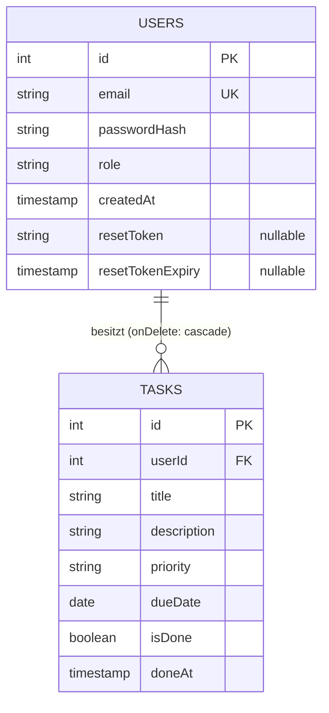

## DB-Schema

```mermaid
erDiagram
    USERS {
        int id PK
        string email UK
        string passwordHash
        string role
        timestamp createdAt
        string resetToken "nullable"
        timestamp resetTokenExpiry "nullable"
    }

    TASKS {
        int id PK
        int userId FK
        string title
        string description
        string priority
        date dueDate
        boolean isDone
        timestamp doneAt
    }

    USERS ||--o{ TASKS : "besitzt (onDelete: cascade)"
```

Entspricht dem tatsächlichen Schema in [`backend/src/schema.ts`](../../backend/src/schema.ts) – siehe
[`db-schema.md`](./db-schema.md) für Begründungen der einzelnen Felder.
