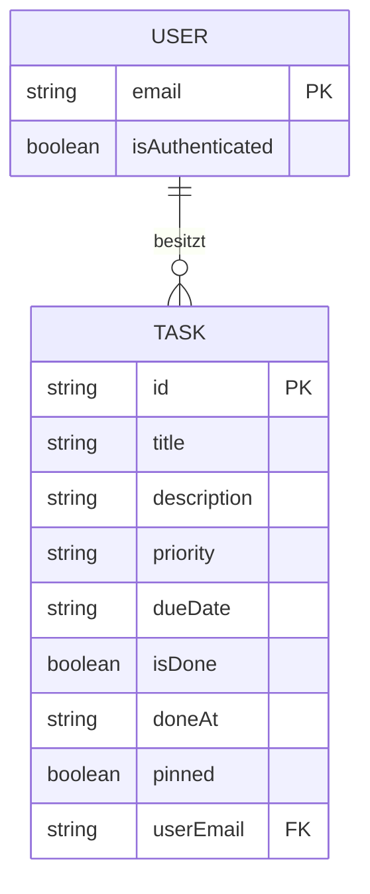

# Entity-Relationship-Diagramm

```mermaid
erDiagram
    USER {
        string email PK
        boolean isAuthenticated
    }

    TASK {
        string id PK
        string title
        string description
        string priority
        string dueDate
        boolean isDone
        string doneAt
        boolean pinned
        string userEmail FK
    }

    USER ||--o{ TASK : "besitzt"
```
