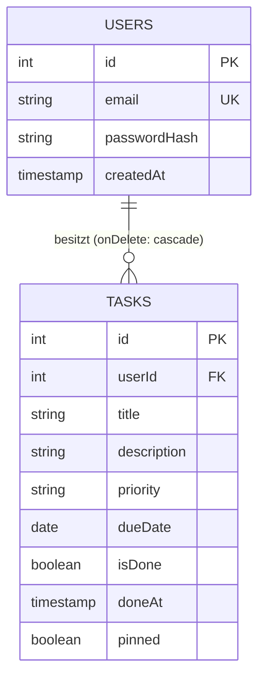

## DB-Schema

```mermaid
erDiagram
    USERS {
        int id PK
        string email UK
        string passwordHash
        timestamp createdAt
    }

    TASKS {
        int id PK
        int userId FK
        string title
        string description
        string priority
        date dueDate
        boolean isDone
        timestamp doneAt
        boolean pinned
    }

    USERS ||--o{ TASKS : "besitzt (onDelete: cascade)"
```
